# Vision-Based Intelligent Football Analytics

**Date:** 2025-June-02

**Author:** Dongjun Han 21700766, Junjae Lee 22000573

**Github:**  [repository link](https://github.com/LeeJunjae1/DLIIP_FINAL_21700766_DongjunHan_22000573_JunjaeLee)

**PDF version:** [PDF](./DLIP_FINAL_21700766_DongjunHan_22000573_JunjaeLee.pdf)

**Demo Video**: [Youtube_link](https://www.youtube.com/watch?v=00-XCQsEvEs)


## Introduction

 Analyzing key aspects of football — such as player tracking, ball possession, and event detection — presents significant challenges in the absence of computer vision. This difficulty is especially pronounced in fast-paced amateur or local matches, where gameplay is highly dynamic and unpredictable. Traditional manual analysis not only demands substantial time and effort, but is also highly prone to human error, making it impractical for regular use in grassroots or community-level games.

 To address these limitations, we propose an AI-powered computer vision system tailored specifically for football environments. By leveraging lightweight and efficient deep learning models, our system can detect players, estimate their trajectories and movement patterns, recognize critical events such as goals, and automatically generate highlight clips from raw video footage.

 This approach aims to democratize football analytics by bridging the technological gap between high-budget professional match analysis and everyday gameplay. Ultimately, it empowers amateur teams, coaches, and enthusiasts with accessible tools for performance evaluation, tactical feedback, and game review — previously available only at the professional level.

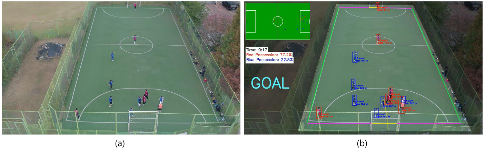

<center><strong>Figure 1. AI-based Football Analysis (a) Video before analysis (b) Video with analysis applied</strong></center>


#### **Target Users**

- Amateur teams
- Youth academies
- School sports programs
- Local leagues

#### **Challenges They Face**

- High cost of equipment and software
- Lack of dedicated analysis staff
- Time-consuming manual review
- High technical barriers for setup and use

#### **Our Solution**

- Low-cost, fully automated match analysis
- Auto-generated highlight clips
- Real-time tracking and tactical feedback without human intervention


## Problem Statement

| No.  | Feature                                                      | Detailed Criteria                                            |
| ---- | ------------------------------------------------------------ | ------------------------------------------------------------ |
| 1    | **Detect players by team color**                             | - Players must be accurately classified into two teams based on vest color (e.g., red vs blue).<br> - Accuracy goal: ≥ 90% correct team classification per frame.<br> - Uses color thresholds in HSV |
| 2    | **Detect the ball**                                          | - Ball must be detected and tracked across frames.<br> - Detection accuracy goal: ≥ 85% presence in all frames where the ball is visible.<br> - Must handle small size, motion blur, and player occlusion. |
| 3    | **Visual trail effect for the ball**                         | - Ball path should be rendered as a fading line for the last few seconds.<br> - Must update in real-time and fade with transparency.<br> - Useful for visualizing speed and direction. |
| 4    | **Display player speed (km/h)**                              | - Compute speed using position displacement per frame.<br> - Calibrated to real-world scale using known field size.<br> - Display speed as a number above each player's bounding box. |
| 5    | **Display player activity (distance in meters)**             | - Cumulative distance tracked per player.<br> - Accuracy within ±10% of actual path length (based on frame rate and calibration). |
| 6    | **Display team ball possession (%)**                         | - Based on time of control: who is nearest to the ball per frame.<br> - Rolling window or cumulative since start of half.<br> - Updated every second, rounded to nearest integer.<br> - Display with LED ring or UI bar.<br> - Must include serial output format: `"60,40"` for Red vs Blue. |
| 7    | **Draw field lines (corner, sideline, goal) with different colors** | - Overlay known field layout.<br> - Color-code: e.g., yellow (goal), light green (sideline), purple (corner).<br> - Must align to within ±20 pixels of actual line. |
| 8    | **Detect and classify ball out-of-bound events (corner, sideline, goal)** | - Based on ball crossing predefined line boundaries.<br> - Event classification:<br>     - "GOAL": crosses goal line inside post<br>     - "Throw-In": crosses sideline<br>     - "Goal Line Out" : crosses goal line<br> - Trigger LED signal & log event with timestamp. |
| 9    | **Generate 2D heatmap of player movement**                   | - Create 2D heatmap for each player or team using accumulated positions.<br> - Update in real time or per session.<br> - Export as image or overlay on field.<br> - Resolution: at least 50×30 grid cells. |
| 10   | **Create goal highlight clip and send by email**             | - Save 10-second video clip: 5s before + 5s after a "GOAL" event.<br> - Auto-generate using buffer frames.<br> - Send as email attachment (MP4 format, <20MB).<br> - Must include event timestamp in filename. |


### Task Distribution

**Dongjun**
 → Responsible for tracking-based statistical analysis and numerical evaluation features, including team classification, player speed, distance covered, ball possession ratio, and 2D heatmap generation.

**Junjae**
 → In charge of visual effects and event processing, including ball detection and trail rendering, field line recognition, out-of-bound classification, and automatic highlight generation.


## Requirement

### Hardware List

* LOLIN D32 Pro V2.0.0 ESP-32 WiFi-Bluetooth Combo

* 24 x WS2812B 5050 RGB LED RING-Black [SZH-LD088]

  


### Software Installation

* Python 3.9.18
* YOLO v8
* pytorch 2.1.2
* numpy 1.26.0
* ultralytics 8.0.140
* pyserial 3.5
* pygame 2.6.1
* OpenCV 4.11.0


## Dataset & Reference

#### **Dataset link**: 

- Football Video: [축구드론영상\ VITNA FC 축구]([[축구드론영상\] VITNA FC 축구 | 2023년11월4일 - YouTube](https://www.youtube.com/watch?v=ZCv8W7u1-7A&t=1143s))


#### **Reference:**

- The initial ideas for person and ball detection, team classification, and ball possession tracking using YOLO were inspired by various video platforms such as YouTube. However, all datasets and code used in this project were developed independently without relying on any external references.


## Method

* This system analyzes futsal game footage in real time to detect match events (such as goals, throw-ins, and goal-line outs) and visually represents them by integrating with hardware (LEDs and ESP32).
* It also uses YOLOv8 and bytetrack to detect players and the ball, analyzing each player's activity level, speed, team classification, and ball possession. A highlight video is automatically saved and sent via email when specific events occur.
* YOLOv8 is used to detect players and the ball in the video (with the 'track' mode for players and 'predict' mode for the ball).
* The system was tested on various match videos to evaluate the accuracy of event detection. It was verified whether events such as goals, throw-ins, and goal-line outs matched the actual game situations. The consistency of player and ball detection was also checked, along with successful execution of highlight video saving and email-sending features.


## Algorithm

**Flow Chart**

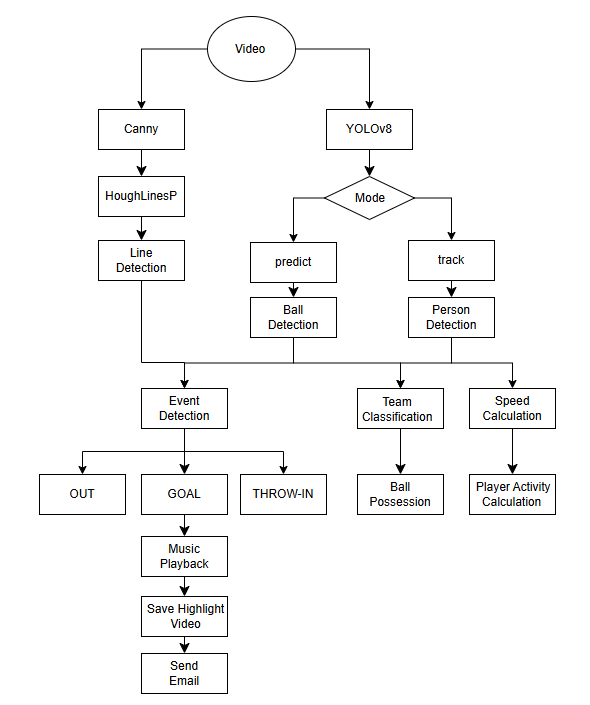


## Procedure

### 1. Installation

**Anaconda settings**

before starting, check if the GPU driver for the cuda version is installed

```python
# Check your CUDA version
> nvidia-smi
```


```python
# Update CONDA in Base
conda update -n base -c defaults conda

# Create myEnv=yolov8
conda create -n yolov8 python=3.9.18 -y
conda activate yolov8

# Install Numpy, OpenCV, Matplot, Jupyter
conda install -c anaconda numpy=1.26.0 seaborn jupyter matplotlib -y
pip install opencv-python==4.11.0.86
pip install pyserial==3.5
pip install torchsummary
pip install onnx

conda install -c nvidia pytorch-cuda=11.8 -y
conda install -c pytorch pytorch=2.1.2 -y
conda install -c pytorch torchvision -y

pip install ultralytics==8.0.140  
pip install lapx>=0.5.2
pip install py-cpuinfo
```


**Additional installation required for music playback**

```python
pip install pygame==2.6.1
```


**Additional installation required for Arduino operation**

```python
pip install pyserial
```


---

### 2. Hardware Setting

 This project uses two main hardware components: the LOLIN D32 Pro V2.0.0 development board  and a 24-pixel WS2812B RGB LED ring module. The setup enables real-time visual feedback for both  possession percentages and match events such as goals or throw-ins in a futsal game analysis system.


#### 2.1. LOLIN D32 Pro V2.0.0 (ESP32 WiFi-Bluetooth Combo  Board)

 **Specifications:** 

* **Chipset**: Espressif ESP-WROVER (ESP32 dual-core MCU) 
* **Flash Memory**: 16MB PSRAM: 8MB 
* **Connectivity:** WiFi and Bluetooth combo 
* **Battery Support:** LiPo battery interface with charging circuit (max 500mA charging current) 
* **Peripheral Ports**: Built-in LOLIN I2C and TFT interface 
* **Storage**: MicroSD (TF) card slot with SPI mode support 
* **Arduino Compatible**


**Purpose in This Project:** 

 The LOLIN D32 Pro serves as the main controller for the system. It receives match data via serial  communication, processes it, and controls two LED rings using the FastLED library. The board’s  integrated MicroSD card slot also allows for potential expansion into logging or video synchronization.  Its dual-core processing capability ensures smooth handling of both data reception and LED  rendering.

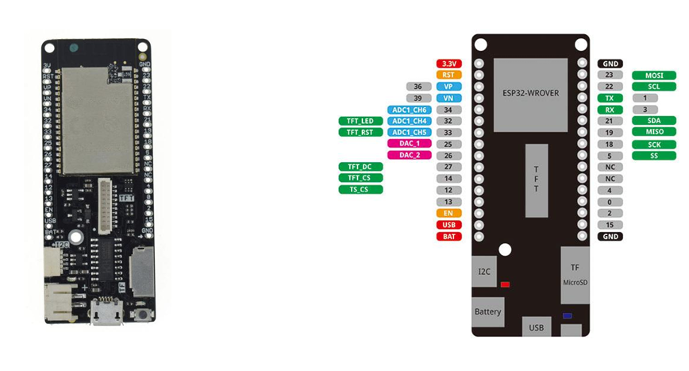

<center><strong>Figure 2. Image of LOLIN D32 Pro V2.0.0</strong></center>


#### 2.2. 24 x WS2812B RGB LED Ring Module (Black Circular Type)

**Specifications**: 

* **LED Type**: WS2812B (integrated RGB with data line control, NeoPixel compatible) 
* **Quantity**: 24 RGB LEDs arranged in a circular ring 
* **Outer Diameter**: 86mm 
* **Voltage:** 5V DC (operating range 4V ~ 7V) 
* **Data Protocol**: Single-wire control (compatible with FastLED and Adafruit NeoPixel libraries) 


**Pins Used:** 

* **Pin 27**: Used to control the “score” LED ring for displaying team possession percentage. 

* **Pin 26**: Used to control the “event” LED ring for signaling game events such as goals or throw-ins. 

  

**Purpose in This Project:** 

Two identical 24-LED rings were used for dual visual outputs: 

1. **Possession Indicator (LED_PIN_SCORE – Pin 27)** 
   * Displays red/blue division based on current possession ratio (e.g., 50:50). 
   * Dynamically updated upon receiving serial input such as  "60, 40".
2. **Event Display (LED_PIN_EVENT – Pin 26)**
   * Visually emphasizes special game events.
   * Animated rainbow (goal), fluorescent green (throw-in), or purple (out), with fallback to white  when idle.

 The ring format offers a clear, easily interpretable visual interface suitable for real-time audience  feedback or player analysis.


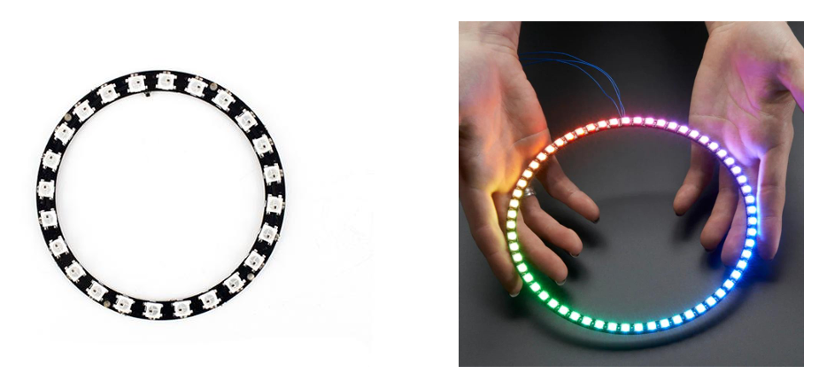

<center><strong>Figure 3. Image of 24 x WS2812B RGB LED Ring Module</strong></center>

---

### 3. LED Logic and Functionality

 The hardware logic is divided into two primary LED output systems controlled via two digital pins on  the LOLIN D32 Pro board:


#### 3.1. Ball Possession Visualization (Pin 27)

 Pin 27 controls a 24-LED WS2812B ring dedicated to displaying real-time ball possession ratio  between two teams—Red and Blue. 

* The possession percentage is calculated based on time accumulation: as each team gains  control of the ball over time, their possession ratio increases. 
* For instance, if the red team has had possession for 60% of the total elapsed time and the blue  team for 40%, the ring will light up 14 LEDs in red and 10 LEDs in blue (since 14/24 ≈ 58.3%,  rounded). 
* This ratio is updated dynamically via serial input in the format  "60,40" (representing red and  blue percentages), and the LED ring visually reflects this balance in real-time. 

 This provides a clear and immediate visual representation of which team is dominating possession  during the match.


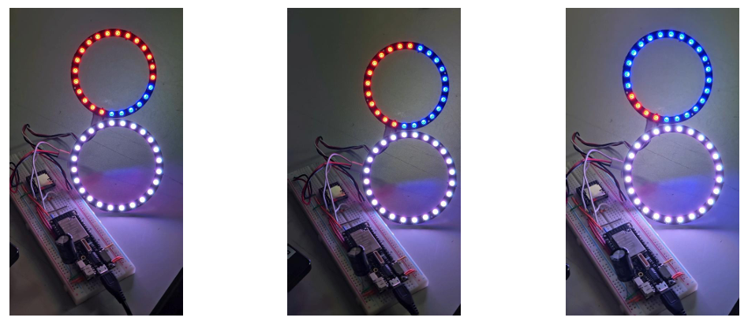

<center><strong>Figure 4. Visualization of ball possession using LEDs</strong></center>


#### 3.2. Event Indicator (Pin 26)

 Pin 26 controls a second 24-LED WS2812B ring that reflects in-game events through distinct light  animations and colors: 

* **White (Default)**: When no specific event is active, the ring remains white, serving as a neutral  standby state. 
* **Fluorescent Green – “THROWIN”**: Triggered when the ball goes out for a throw-in. The ring  glows solid bright green to indicate the restart type. 
* **Vivid Purple – “OUT”**: Activated when the ball crosses the goal line but no goal is scored (e.g.,  goal kick or corner). The ring turns solid fluorescent purple. 
* **Rainbow Wave – “GOAL”**: When a goal is scored, the ring enters a dynamic rainbow animation  that creates a wave-like motion, emphasizing the celebratory nature of the moment. 

 These effects are triggered via serial commands ( "GOAL" ,  "THROWIN" , or  "OUT" ), and automatically  reset to white after a fixed duration, creating a visually engaging and intuitive event feedback  system for viewers or players.


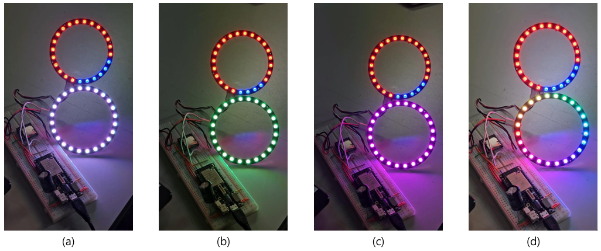

<center><strong>Figure 5. Event representation using LEDs. (a) Default (b) THORWIN (c) OUT (d) GOAL</strong></center>

-----

### 4. 'bytetrack.yaml' Setting

* The  bytetrack.yaml file can be found at the following relative path from the project root: 

**File Path**:  User's environment path

```python
import ultralytics
import os

# ultralytics 설치 위치 확인
ultralytics_path = os.path.dirname(ultralytics.__file__)

# bytetrack.yaml 파일 경로 구성
bytetrack_yaml_path = os.path.join(ultralytics_path, 'cfg', 'trackers', 'bytetrack.yaml')

print("ByteTrack.yaml 경로:", bytetrack_yaml_path)
```


####  4.1. Purpose of This File

 This configuration file defines the default settings used when applying the ByteTrack tracker in the  Ultralytics YOLO framework. While YOLO is responsible for object detection, ByteTrack builds on  YOLO’s output to associate and track detected objects across frames. 

 The file includes key hyperparameters that control how detected objects are matched, tracked, and  maintained over time, directly influencing the stability and accuracy of object tracking.


#### 4.2. Modified Parameters and Explanation

##### 4.2.1. track_high_thresh: 0.001

**Original Purpose:**

 This parameter defines the confidence threshold for the first association step in tracking. Only  detections with confidence above this threshold are considered for matching with existing tracks.

**Reason for Modification**:

 By lowering the value from a typical setting (e.g., 0.5) to 0.001, nearly all detections, including those  with very low confidence, are included in the initial matching step.  This helps ensure that even uncertain detections are not prematurely discarded and can still be  linked to existing object tracks.


##### 4.2.2. track_low_thresh: 0.001 

**Original Purpose:**  

 Used in the second association step for unmatched tracks. It defines the minimum confidence  required for a detection to be considered as a match for remaining unmatched tracks. 

**Reason for Modification:**  

 Setting this to 0.001 means that essentially all detections will be evaluated for second-step matching.  This helps retain tracks even if the detection confidence is low, improving track continuity in difficult  conditions (e.g., occlusion, motion blur). 


##### 4.2.3. match_thresh: 0.9  

**Original Purpose:**  

 This parameter sets the IOU (Intersection over Union) threshold used to determine whether a  detection sufficiently overlaps with a track to be considered the same object. 

**Reason for Modification:**  

 Raising this threshold to 0.9 (from a typical value like 0.7) enforces stricter spatial matching,  reducing the risk of incorrectly associating different objects.  While this improves tracking accuracy, it may increase the number of new IDs created due to the  stricter matching criteria.


####  4.3. ByteTrack Configuration

 The following configuration file defines key parameters for the ByteTrack object tracking algorithm  within the Ultralytics YOLO framework. ByteTrack is responsible for maintaining consistent object IDs  across video frames based on bounding box matching and confidence thresholds. This configuration  has been tuned to improve object continuity and tracking robustness under challenging conditions.

```python
# Ultralytics 🚀 AGPL-3.0 License - https://ultralytics.com/license

# Default Ultralytics settings for ByteTrack tracker when using mode="track"
# For documentation and examples see https://docs.ultralytics.com/modes/track/
# For ByteTrack source code see https://github.com/ifzhang/ByteTrack

tracker_type: bytetrack # tracker type, ['botsort', 'bytetrack']
track_high_thresh: 0.001 # threshold for the first association
track_low_thresh: 0.001 # threshold for the second association
new_track_thresh: 0.25 # threshold for init new track if the detection does not match any tracks
track_buffer: 30 # buffer to calculate the time when to remove tracks
match_thresh: 0.9 # threshold for matching tracks
fuse_score: True # Whether to fuse confidence scores with the iou distances before matching
# min_box_area: 10  # threshold for min box areas(for tracker evaluation, not used for now)

```

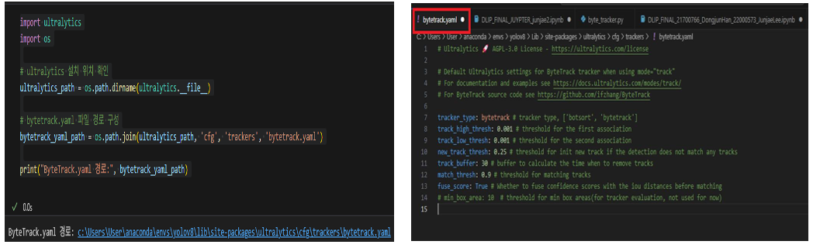

<center><strong>Figure 6. Example of bytetrack.yaml configuration</strong></center>

---

### 5. Python Code Integrated with ESP-32

 Using HoughLinesP, the system detects lines on a futsal field from video input to determine events such as throw-ins, out-of-bounds, and goals. These events are then visually represented through hardware integration with the ESP-32.

 YOLOv8 is employed to detect humans and the soccer ball, enabling further analysis. Players are classified into two teams, and metrics such as player speed, activity level, and team ball possession are calculated.

 The ball's movement is visualized in real time by tracking its trail. When a goal is detected, a highlight video is automatically saved, and an email is sent to the scoring team.

**Full Code**: [Github Link](https://github.com/LeeJunjae1/DLIIP_FINAL_21700766_DongjunHan_22000573_JunjaeLee) (Download all files from the repository to run the program)


#### 5.1. Code for Running the ESP-32

**Purpose:**

 This code is used to visualize events through hardware. It is crucial to check the serial port before use. In Visual Studio Code, the ESP-32 operates according to the specified flag provided during execution.

 By default, the LED is white. It turns green for a throw-in, purple for a goal-line out, and displays rainbow colors when a goal is scored.


**5.1.1. Initial Setup in VSCode**

* Used to configure the initial settings for integrating the ESP-32. The port (e.g., COM3) should be adjusted according to the user's environment.

```python
# 시리얼 포트 연결, ESP-32와 연동

# COM3의 경우 변동이 필요. 사용자의 설정에 따라 변경 필요
try:
    ser = serial.Serial('COM3', 115200)
    print("시리얼 포트 연결 성공")
except serial.SerialException as e:
    print("시리얼 포트 연결 실패:", e)
    ser = None

```

* The active port can be identified in the Ports section of the Device Manager

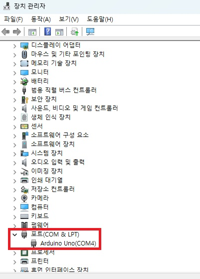

<center><strong>Figure 7. Port Check Example</strong></center>


**5.1.2. Serial Transmission within the Real-Time Video Analysis Code**

* When an event occurs, a corresponding flag is sent to the ESP-32. The ESP-32 then operates according to the received flag. The LED indicates each event with a specific color: purple for a goal-line out, green for a throw-in, and rainbow for a goal.

``` python
# 6. 시리얼 전송 (항상 시도)
if ser:  # 시리얼 포트가 정상적으로 열려 있는 경우에만 실행
    try:
        # 1. 이벤트 전송 우선 (변화 있을 때만)
        current_event = ""  # 현재 이벤트를 저장할 변수 초기화

        if goal_flag:
            current_event = "GOAL"  # 골이 발생했을 경우 "GOAL" 이벤트로 설정
        elif throwin_flag:
            current_event = "THROWIN"  # 스로인 상황이면 "THROWIN"
        elif goal_line_flag:
            current_event = "OUT"  # 공이 골라인을 벗어난 경우 "OUT"

        if current_event != "":
            # 이벤트가 발생한 경우 (빈 문자열이 아니면) 시리얼로 전송
            ser.write(f"{current_event}\n".encode())

        # 2. 점유율 전송 (항상 또는 주기적 혹은 변화가 있을 때만)
        current_possession = f"{int(red_pct)},{int(blue_pct)}"

        if current_possession != last_possession_sent:
            # 이전에 보낸 점유율과 다를 경우에만 전송하여 중복 전송 방지
            ser.write(f"{current_possession}\n".encode())
            last_possession_sent = current_possession  # 마지막으로 보낸 점유율 갱신

    except serial.SerialException:
        # 시리얼 통신 중 오류 발생 시 출력
        print("시리얼 전송 실패")

```


#### 5.2. Line Detection Process

**Purpose:**

 Used to detect lines on the futsal field, apply color overlays to the image, and determine whether an event is a goal-line out, goal, or throw-in.


**5.2.1 ROI Application Function**

* Since areas outside the field lines are not of interest, masking is applied to exclude them.

```python
# 필드 라인따기 (필드 외곽 테두리만 추출하기 위한 마스크 생성 함수)
def get_border_mask(frame):
    h, w = frame.shape[:2]  # 프레임의 높이(h)와 너비(w)를 가져옴

    mask = np.zeros((h, w), dtype=np.uint8)  # 동일한 크기의 검은색 마스크 이미지 생성 (초기값 0)

    # ROI(관심 영역, Region of Interest) 설정: 필드 외곽 영역 다각형
    outer_polygon = np.array([[750, 40], [480, 995], [1760, 995], [1350, 40]])
    cv2.fillPoly(mask, [outer_polygon], 255)  # 외곽 다각형 부분을 흰색(255)으로 채움

    # 내부 영역 설정: 필드 중앙 쪽을 다시 0으로 만들어 테두리만 남김
    inner_polygon = np.array([[780, 60], [550, 955], [1680, 955], [1320, 60]])
    cv2.fillPoly(mask, [inner_polygon], 0)  # 내부 다각형 영역을 다시 검정색(0)으로 덮어 지움

    return mask  # 최종적으로 테두리만 남은 마스크 반환

```


**5.2.2. Function to Find Intersections**

* Detects four main lines within the futsal field. Even if the detected lines are short, they can be extended to form the full boundaries of the futsal field. By calculating the intersection points of these extended lines, the field lines can be accurately represented.

```python
def intersection(line1, line2):
    # 두 직선(line1, line2)의 교점을 계산하는 함수
    # 각 직선은 기울기(m)와 y절편(b)으로 표현됨: y = mx + b
    m1, b1 = line1
    m2, b2 = line2

    # 1. 둘 다 수직선인 경우 (기울기가 없음): x = b 형태 -> 교점 없음
    if m1 is None and m2 is None:
        return None  # 두 수직선이 평행하면 교점 없음

    # 2. 첫 번째 선만 수직선인 경우: x = b1
    if m1 is None:
        x = b1  # 수직선은 x=b1 이므로 x 좌표는 b1
        y = m2 * x + b2  # 두 번째 선의 y 값을 계산
        return int(x), int(y)  # 정수형 좌표로 반환

    # 3. 두 번째 선만 수직선인 경우: x = b2
    if m2 is None:
        x = b2  # x 좌표는 b2
        y = m1 * x + b1  # 첫 번째 선에서의 y값 계산
        return int(x), int(y)

    # 4. 두 직선이 서로 평행한 경우 (기울기가 같음)
    if m1 == m2:
        return None  # 평행선은 교점 없음

    # 5. 일반적인 경우: 두 선의 교점 계산
    x = (b2 - b1) / (m1 - m2)  # 두 선의 교점 x좌표 계산
    y = m1 * x + b1  # x를 이용해 y 좌표 계산

    return int(x), int(y)  # 정수형 튜플로 반환

```


**5.2.3. Function to Find the Equation of a Line**

* To extend a line, it is necessary to determine the linear equation representing that line. Once the equation is obtained, lines of any desired length can be freely drawn.

```python
def line_equation(x1, y1, x2, y2):
    # y = mx + b 형태의 직선 방정식 반환 (m, b)
    if x2 - x1 == 0:  # 수직선 처리
        return None, x1
    m = (y2 - y1) / (x2 - x1)
    b = y1 - m * x1
    return m, b
```


**5.2.4. Line Detection within the Real-Time Video Analysis Code**

* Lines are detected using HoughLinesP. To reduce noise, lines shorter than a specified length are ignored. Since the futsal field lines are primarily white, lines with a low white ratio in the HSV color space are also filtered out. Among horizontal lines, the top line of the frame is selected as the one with the smallest y-coordinate, and the bottom line is the one with the largest y-coordinate. For vertical lines, the leftmost line is chosen as the one closest to the left edge of the frame, and the rightmost line is the one closest to the right edge. Drawing lines are displayed in green, goal-line outs in purple, and goal lines in yellow.

```python
detected_lines = [] # 라인 검출
while cap.isOpened():
    ret, frame = cap.read()
    if not ret:
        break

    frame_copy = frame.copy()    
    
    # 첫 번째 프레임에서만 라인 검출을 수행하여 필드 라인을 추정
    if first_frame:
        gray = cv2.cvtColor(masked_frame, cv2.COLOR_BGR2GRAY)  # 그레이스케일로 변환
        blurred = cv2.GaussianBlur(gray, (5, 5), 0)  # 블러링으로 노이즈 제거
        edges = cv2.Canny(blurred, 50, 150)  # Canny 알고리즘으로 엣지 검출
        edges_masked = cv2.bitwise_and(edges, edges, mask=border_mask)  # 필드 테두리 마스크 적용

        # 허프 변환으로 직선 검출
        lines = cv2.HoughLinesP(edges_masked, 1, np.pi / 180, threshold=50,
                                minLineLength=30, maxLineGap=30)

        h, w = frame.shape[:2]

        # HSV 색공간으로 변환 후 흰색 범위 설정 (필드 라인을 위한 마스크)
        hsv = cv2.cvtColor(frame, cv2.COLOR_BGR2HSV)
        lower_white = np.array([0, 0, 120])
        upper_white = np.array([180, 60, 255])

        # 검출된 라인이 있을 경우
        if lines is not None:
            for line in lines:
                x1, y1, x2, y2 = line[0]

                # 라인의 양 끝 점이 trapezoid (ROI) 안에 있어야 함
                p1_in = cv2.pointPolygonTest(trapezoid_pts.astype(np.float32), (float(x1), float(y1)), False) >= 0
                p2_in = cv2.pointPolygonTest(trapezoid_pts.astype(np.float32), (float(x2), float(y2)), False) >= 0
                if not (p1_in and p2_in):
                    continue

                # 너무 짧은 라인은 제외
                length = math.hypot(x2 - x1, y2 - y1)
                if length < 150:
                    continue

                # 각도 계산
                angle = abs(np.degrees(np.arctan2(y2 - y1, x2 - x1)))

                # 위/아래 끝에 너무 가까운 라인은 제외
                if angle <= 30 and (y1 >= 990 or y2 >= 990) or (y1 < 40 or y2 < 40):
                    continue
                if angle > 30 and (y1 >= 990 or y2 >= 990) or (y1 < 40 or y2 < 40):
                    continue

                # 라인 영역에서 흰색 비율 확인
                x_min = max(min(x1, x2), 0)
                y_min = max(min(y1, y2), 0)
                x_max = min(max(x1, x2), w - 1)
                y_max = min(max(y1, y2), h - 1)
                roi = hsv[y_min:y_max + 1, x_min:x_max + 1]
                if roi.size == 0:
                    continue

                # 흰색 비율 계산 (0.05보다 작으면 제외)
                white_mask_roi = cv2.inRange(roi, lower_white, upper_white)
                white_ratio = cv2.countNonZero(white_mask_roi) / (roi.shape[0] * roi.shape[1] + 1e-5)
                if white_ratio <= 0.05:
                    continue

                # 기준점과 기울기 정보 저장
                rep_x, rep_y = (x1, y1) if y1 < y2 else (x2, y2)
                y_base_x = x1 if y1 > y2 else x2
                detected_lines.append(((x1, y1, x2, y2), rep_x, angle, y_base_x))

        first_frame = False  # 이후 프레임에서는 라인 재검출하지 않음

    # 검출된 라인들을 방향별로 분류
    left_lines = [line for line in detected_lines if max(line[0][0], line[0][2]) < 900 and line[2] > 30]
    right_lines = [line for line in detected_lines if min(line[0][0], line[0][2]) >= 900 and line[2] > 30]
    top_lines = [line for line in detected_lines if (line[2] <= 40 or line[2] >= 150) and (40 < min(line[0][1], line[0][3]) < 100)]
    bottom_lines = [line for line in detected_lines if (line[2] <= 40 or line[2] >= 150) and min(line[0][1], line[0][3]) >= 900]

    # 상단 라인: 가장 위쪽(y 좌표가 가장 작은 라인)
    top_line = min(top_lines, key=lambda l: min(l[0][1], l[0][3])) if top_lines else None
    # 하단 라인: 가장 아래쪽(y 좌표가 가장 큰 라인)
    bottom_line = max(bottom_lines, key=lambda l: max(l[0][1], l[0][3])) if bottom_lines else None
    # 왼쪽 라인: 기준 y가 가장 큰 선
    left_line = max(left_lines, key=lambda l: l[3]) if left_lines else None
    # 오른쪽 라인: 기준 y가 가장 큰 선
    right_line = max(right_lines, key=lambda l: l[3]) if right_lines else None

    # 각 직선에 대해 (기울기, 절편) 계산
    lines_eq = {}
    for name, line in zip(["left", "right", "top", "bottom"], [left_line, right_line, top_line, bottom_line]):
        if line is None:
            lines_eq[name] = None
        else:
            x1, y1, x2, y2 = line[0]
            m, b = line_equation(x1, y1, x2, y2)
            lines_eq[name] = (m, b)

    # 각 선 간 교점 계산 (왼-위, 위-오, 오-아래, 아래-왼 순서)
    if None not in (lines_eq["left"], lines_eq["top"], lines_eq["right"], lines_eq["bottom"]):
        pt_left_top = intersection(lines_eq["left"], lines_eq["top"])
        pt_top_right = intersection(lines_eq["top"], lines_eq["right"])
        pt_right_bottom = intersection(lines_eq["right"], lines_eq["bottom"])
        pt_bottom_left = intersection(lines_eq["bottom"], lines_eq["left"])
        pts = [pt_left_top, pt_top_right, pt_right_bottom, pt_bottom_left]

        # 교점이 모두 존재하면 사각형 그리기
        if all(pt is not None for pt in pts):
            for i in range(4):
                x1, y1 = pts[i]
                x2, y2 = pts[(i + 1) % 4]

                dx = x2 - x1
                dy = y2 - y1
                angle = abs(np.degrees(np.arctan2(dy, dx)))  # 라인의 기울기

                # 사이드 라인 (수직에 가까움): 형광 초록
                if 40 < angle < 150:
                    color = (57, 255, 20)
                    cv2.line(frame_copy, (x1, y1), (x2, y2), color, 3)

                    # 왼쪽이면 throwin 기준점 저장
                    m, b = line_equation(x1, y1, x2, y2)
                    if max(x1, x2) < 900:
                        if m is not None:
                            throwin_line_x = max(x1, x2)
                        left_m, left_b = m, b
                    else:
                        if m is not None:
                            throwin_line_x = max(x1, x2)
                        right_m, right_b = m, b

                # 골라인 또는 코너킥 라인 (수평에 가까움): 형광 보라
                else:
                    color = (255, 0, 255)
                    cv2.line(frame_copy, (x1, y1), (x2, y2), color, 3)

                    m, b = line_equation(x1, y1, x2, y2)
                    if m is not None:
                        x_mid = (x1 + x2) // 2
                        offset = 100 if max(y1, y2) >= 800 else 50
                        x_left = x_mid - offset
                        x_right = x_mid + offset
                        y_left = int(m * x_left + b)
                        y_right = int(m * x_right + b)

                        # 유효 범위 내의 점이면 노란 선 그리기
                        if 0 <= x_left < w and 0 <= x_right < w and 0 <= y_left < h and 0 <= y_right < h:
                            cv2.line(frame_copy, (x_left, y_left), (x_right, y_right), (0, 255, 255), 4)

                            # 최상단 노란선이면 별도 저장
                            if y_left < 100 or y_right < 100:
                                yellow_line_top = (x_left, x_right, y_left, y_right)
                            yellow_line = (x_left, x_right, y_left, y_right)

```


#### 5.3. Dimming the Area Outside the Soccer Field

**Purpose:**

 To help focus more on the soccer field by dimming the area outside the field.


**5.3.1. Code for Dimming the Area Outside the Soccer Field within the Real-Time Video Analysis**

* Masking is applied to extract the areas outside the region of interest. Then, transparency is applied to these areas to make them less visible, allowing better focus on the interior of the soccer field.

```python
trapezoid_pts = np.array([[750, 40], [480, 995], [1760, 995], [1350, 40]]) # 관심없는 영역을 어둡게 하기 위한 좌표


frame_copy = frame.copy()    

# 관심 있는 영역(사다리꼴 영역)을 제외한 나머지 화면을 어둡게 처리하여 강조하기 위한 코드
# 사다리꼴 모양의 관심 영역 좌표 설정 (좌상, 좌하, 우하, 우상)
trapezoid_pts = np.array([[740, 20], [430, 1050], [1830, 1050], [1360, 30]])
# 원본 프레임과 동일한 크기의 검은 마스크 생성
mask = np.zeros_like(frame_copy, dtype=np.uint8)
# 관심 영역을 하얀색으로 채움
cv2.fillPoly(mask, [trapezoid_pts], (255, 255, 255))
# 관심 영역의 반전 마스크 생성 
inv_mask = cv2.bitwise_not(mask)
# 검은 배경 이미지 생성
black_overlay = np.zeros_like(frame_copy, dtype=np.uint8)
# 투명도 설정 
alpha = 0.5
# 관심 없는 영역만 오버레이 처리: 검은 배경과 원본 영상의 비율로 합성
overlay = cv2.addWeighted(
    cv2.bitwise_and(black_overlay, inv_mask), alpha,  # 어두운 영역
    cv2.bitwise_and(frame_copy, inv_mask), 1 - alpha, # 원본 영역
    0  # 감마 보정 없음
)
# 관심 영역은 원본 영상 그대로, 나머지는 오버레이 적용된 영상 결합
frame_copy = cv2.bitwise_or(overlay, cv2.bitwise_and(frame_copy, mask))

```


#### 5.4. Player Detection

**Purpose:**

 To calculate player speed, activity level, and team classification, it is necessary to detect players in the video. YOLOv8’s “track” mode is used to maintain consistent IDs for detected players across frames. This reduces errors when calculating players’ speed and activity levels.


**5.4.1. Player Detection within the Real-Time Video Analysis Code (Team Classification, Speed Calculation, Activity Calculation)**

* Players are classified into teams using HSV color space. Based on the uniform colors, players are divided into the red team and the blue team, with weighted color values applied to improve classification accuracy. YOLOv8 provides player coordinates, which are used along with frame-to-frame changes to calculate player speed and activity level. Activity is expressed in meters by applying a scale of 0.02 meters per pixel, while speed is expressed in kilometers per hour (km/h). Additionally, people detected outside the soccer field are excluded to ensure only players within the field are analyzed.

```python
frame_count += 1 #프레임 수 증가
current_players = {}

# 사람을 찾기 위해, 사람을 누적해서 검출 진행
results = model.track(source=frame, persist=True, conf=0.001, iou=0.5, classes=[0], tracker="bytetrack.yaml")
    

# 사람을 감지한 경우 처리
if results and results[0].boxes is not None:
    boxes = results[0].boxes
    xyxy = boxes.xyxy.cpu().numpy()  # 사람마다 경계 박스 좌표 (x1, y1, x2, y2)
    confs = boxes.conf.cpu().numpy()  # 각 박스의 신뢰도 점수
    ids = boxes.id.cpu().numpy().astype(int) if boxes.id is not None else range(len(xyxy))  # 객체 ID (없으면 인덱스)

    for i in range(len(xyxy)):
        x1, y1, x2, y2 = map(int, xyxy[i])  # 경계 박스 좌표 정수화
        conf = confs[i]
        obj_id = ids[i]  # 각 객체의 고유 ID

        # 중심 좌표 계산
        cx, cy = (x1 + x2) // 2, (y1 + y2) // 2

        # 경기장 밖에 있는 경우 무시
        if cx > 1500 or cy > 1500:
            continue

        # 박스 좌표가 이미지 영역을 넘지 않도록 보정
        x1_clamped = max(0, x1)
        y1_clamped = max(0, y1)
        x2_clamped = min(frame.shape[1], x2)
        y2_clamped = min(frame.shape[0], y2)

        # 선수의 ROI(영역) 추출
        roi = frame[y1_clamped:y2_clamped, x1_clamped:x2_clamped]

        # 빈 ROI는 무시
        if roi.size == 0:
            continue

        # HSV 색공간으로 변환 (팀 분류를 위해)
        hsv_roi = cv2.cvtColor(roi, cv2.COLOR_BGR2HSV)

        # 빨간색 범위 마스크 생성 (두 개의 hue 영역 + 마젠타 계열)
        red1 = cv2.inRange(hsv_roi, np.array([0, 40, 40]), np.array([20, 255, 255]))
        red2 = cv2.inRange(hsv_roi, np.array([160, 40, 40]), np.array([180, 255, 255]))
        magenta = cv2.inRange(hsv_roi, np.array([140, 40, 40]), np.array([160, 255, 255]))
        red_mask = cv2.bitwise_or(cv2.bitwise_or(red1, red2), magenta)
        red_ratio = np.count_nonzero(red_mask) / red_mask.size  # 빨간색 비율 계산

        # 파란색 범위 마스크 생성
        blue_mask = cv2.inRange(hsv_roi, np.array([90, 70, 50]), np.array([130, 255, 255]))
        blue_ratio = np.count_nonzero(blue_mask) / blue_mask.size  # 파란색 비율 계산

        # 색상 가중치 (빨간팀 감지를 더 강화함)
        red_weight = 3.0
        blue_weight = 2.0
        red_weighted = red_ratio * red_weight
        blue_weighted = blue_ratio * blue_weight

        # 팀 분류 기준 threshold
        red_thresh = 0.01
        blue_thresh = 0.01

        # 색상 비율에 따라 팀 분류
        if red_weighted > blue_weighted and red_weighted > red_thresh:
            team_color = (0, 0, 255)  # 빨간팀 (BGR)
            team_name = "Red Team"
        elif blue_weighted > red_weighted and blue_weighted > blue_thresh:
            team_color = (255, 0, 0)  # 파란팀 (BGR)
            team_name = "Blue Team"
        else:
            team_color = (0, 255, 0)  # 알 수 없음 -> 초록색
            team_name = "Unknown"

        # 현재 선수의 중심 좌표 저장
        current_players[obj_id] = (cx, cy)
        player_colors[obj_id] = team_color  # 해당 선수 팀 컬러 저장

        # 속도 및 총 이동거리 계산
        current_pos = (cx, cy)
        if obj_id in player_last_positions:
            prev_pos = player_last_positions[obj_id]  # 이전 위치
            pixel_dist = euclidean(prev_pos, current_pos)  # 픽셀 거리 계산
            real_dist_m = pixel_dist * pixel_to_meter  # 실제 거리(m)로 변환
            speed_kmh = (real_dist_m * fps) * 3.6  # 속도 계산 (km/h)
            player_distances[obj_id] += real_dist_m  # 누적 이동거리 갱신

            # 속도와 총 이동거리 영상에 표시
            cv2.putText(frame_copy, f"{speed_kmh:.1f} km/h", (cx, cy + 15),
                        cv2.FONT_HERSHEY_SIMPLEX, 0.5, team_color, 2)
            cv2.putText(frame_copy, f"Total: {player_distances[obj_id]:.1f} m", (cx, cy + 35),
                        cv2.FONT_HERSHEY_SIMPLEX, 0.5, team_color, 2)

        # 현재 위치 갱신
        player_last_positions[obj_id] = current_pos

        # 사람 경계 박스 그리기
        cv2.rectangle(frame_copy, (x1, y1), (x2, y2), team_color, 2)
```


#### 5.5. Ball Detection

**Purpose:**

 Used to detect the ball in real time, determine the ball’s movement path, and judge events such as goals, throw-ins, and goal-line outs, as well as to represent team-specific ball possession. Ball detection is also necessary to link events with hardware.


**5.5.1. Code for Ball Detection and Trail Visualization within the Real-Time Video Analysis**

* Since there is only one ball on the field, the prediction mode is used to optimize ball detection. The ball size is set within a specific range to avoid false detections of objects outside that size. To reduce noise, HSV filtering is applied to exclude objects with a high white ratio. The ball used in the video is red, so it is detected when the red component in the HSV color space exceeds a certain threshold. The ball’s trail is visualized by using its previous coordinates, allowing the movement path to be displayed on the image.

```python
# 공을 찾기 위해, 공만 탐지하면 되기에 predict 사용
results_ball = model.predict(frame, classes=[32], conf=0.001)

# 공 탐지 및 처리, 공의 trail 표현
    ball_detected = False  # 공 감지 여부

    # 공을 탐지한 경우
    if results_ball and results_ball[0].boxes is not None:
        boxes = results_ball[0].boxes
        cls = boxes.cls.cpu().numpy().astype(int)
        xyxy = boxes.xyxy.cpu().numpy()
        confs = boxes.conf.cpu().numpy()

        # 공이라고 판단할 사이즈 선정
        min_ball_area = 50
        max_ball_area = 350

        for i, class_id in enumerate(cls):
            if class_id != 32: # cocodataset에서 공의 id는 32번임
                continue
            confidence = confs[i]
            if confidence < 0.001: # 신뢰도를 조정하여 공 검출 진행
                continue

            x1, y1, x2, y2 = map(int, xyxy[i])
            cx, cy = int((x1 + x2) / 2), int((y1 + y2) / 2)

            # 경기장 밖에 있는 공은 탐지 X
            frame_center_x = frame.shape[1] // 2
            if abs(cx) < 300:
                continue

            roi = frame[y1:y2, x1:x2]
            if roi.size == 0:
                continue

            hsv_roi = cv2.cvtColor(roi, cv2.COLOR_BGR2HSV)

            # 탐지할 공의 색상, 흰색 여부 판단
            lower_white = np.array([0, 0, 240])
            upper_white = np.array([180, 50, 255])
            white_mask = cv2.inRange(hsv_roi, lower_white, upper_white)
            white_ratio = np.count_nonzero(white_mask) / white_mask.size

            # 흰색이 일정범위 이상 넘어선 경우 공이라고 판단 진행 X
            if white_ratio > 0.001:
                continue

            # 영상에서 공의 색상은 빨간색이라 빨간색이 존재하는 공 탐지 진행
            lower_red1 = np.array([0, 30, 70])
            upper_red1 = np.array([10, 255, 255])
            lower_red2 = np.array([160, 30, 70])
            upper_red2 = np.array([180, 255, 255])
            red_mask1 = cv2.inRange(hsv_roi, lower_red1, upper_red1)
            red_mask2 = cv2.inRange(hsv_roi, lower_red2, upper_red2)
            red_mask = cv2.bitwise_or(red_mask1, red_mask2)
            red_ratio = np.count_nonzero(red_mask) / red_mask.size
            if red_ratio < 0.05: # 빨간색을 포함하지 않은 경우 공이라고 판단 X
                continue

            #공의 넓이 계산
            width = x2 - x1
            height = y2 - y1
            area = width * height

            # 공의 넓이가 특정 범위보다 넘어선 경우 공이라고 판단 X
            if area < min_ball_area or area > max_ball_area:
                continue

            # 공 좌표 기록
            ball_positions.append((cx, cy))
            if len(ball_positions) > 10:
                ball_positions.pop(0)

            ball_detected = True  # 공 감지됨
            
            # 항상 trail 그리기 (공 감지 여부와 무관)
    if ball_positions:
        # 여러 프레임 겹처서 trail 그리기
        overlay = frame_copy.copy()
        trail_len = len(ball_positions)
        for i in range(1, trail_len):
            pt1 = ball_positions[i - 1]
            pt2 = ball_positions[i]

            alpha = i / trail_len
            color = (0, 255, 255)
            thickness = max(5, int(4 * alpha))

            #투명도를 이용하여 공의 trail 표현 진행
            cv2.line(overlay, pt1, pt2, color, thickness)
            fade = alpha * 0.2
            frame_copy = cv2.addWeighted(overlay, fade, frame_copy, 1 - fade, 0) # 투명도 적용

```


#### 5.6. Determination and Visualization of Goal-Line Out, Throw-in, and Goal Events

**Purpose:**

 Used to determine whether a goal-line out, throw-in, or goal has occurred, and to trigger hardware accordingly. It is also used to send flags for saving highlight videos.


**5.6.1. Code for Determining Goal-Line Out, Throw-in, and Goal Events within the Real-Time Video Analysis**

* A goal occurs when the ball crosses the goal line within the goalpost coordinates. A goal-line out event is flagged when the ball crosses the line outside of the goalpost area. A throw-in is triggered when the ball goes beyond the sideline. The throw-in flag is cleared only when the ball re-enters the field after coming close to a player.

```python
# 공을 탐지한 경우
if results_ball and results_ball[0].boxes is not None:
    boxes = results_ball[0].boxes
    cls = boxes.cls.cpu().numpy().astype(int)
    xyxy = boxes.xyxy.cpu().numpy()
    confs = boxes.conf.cpu().numpy()

    # 공이라고 판단할 사이즈 선정
    min_ball_area = 50
    max_ball_area = 350
    
    
    # 골 판정
    if yellow_line:
        # 골라인 좌표 (영상 아래 골대)
        x_left, x_right, y_left, y_right = yellow_line

        # 골라인 좌표 (영상 위 골대)
        x_left_top, x_right_top, y_left_top, y_right_top = yellow_line_top

            #해당 골라인에 들어간 경우 골이라고 판단 진행
            if x_left <= cx <= x_right:
                if cy >= 800 and cy > max(y_left, y_right):
                    goal_flag = True # 골 flag
                    goal_frame_counter = goal_display_frames # 골 문자를 일정 프레임동안 출력하기 위해
                    red_team_goal_flag = True
                    goal_line_flag=False # 골라인 아웃 flag 초기화
                    throwin_flag=False # 스로인 flag 초기화
                elif cy <= 100 and cy < min(y_left_top, y_right_top):
                    goal_flag = True # 골 flag
                    goal_line_flag=False # 골라인 아웃 flag 초기화
                    throwin_flag=False # 스로인 flag 초기화
                    goal_frame_counter = goal_display_frames # 골 문자를 일정 프레임동안 출력하기 위해
                    blue_team_goal_flag = True

            # 골 라인 아웃 판정
            if cx < x_left or cx > x_right:
                if cy >= 800 and cy > max(y_left, y_right):
                    goal_line_flag = True # 골라인 아웃 flag
                    goal_line_out_counter = goal_display_frames # 골 라인 아웃을 일정 프레임동안 출력하기 위해
                    throwin_flag=False #스로인 flag 초기화

                elif cy <= 100 and cy < min(y_left_top, y_right_top):
                    goal_line_flag = True # 골라인 아웃 flag
                    goal_line_out_counter = goal_display_frames # 골 아웃을 일정 프레임동안 출력하기 위해
                    throwin_flag=False #스로인 flag 초기화
        # throwin 판정
        # 해당 공이 사이드 라인을 벗어난 경우 골라인 아웃이라 판단 진행
        expected_x = int((cy - left_b) / left_m)
        expected_x_right = int((cy - right_b) / right_m)
        if (cx < expected_x) or ((cx > expected_x_right) and (goal_flag is False) and (goal_line_flag is False)):
            # 스로인 flag만 true
            throwin_flag = True
            goal_line_flag = False
            goal_flag = False


        # 거리 체크, 스로인 진행 여부를 판단하기 위해
        for player_pos in current_players.values():
            dist = np.linalg.norm(np.array(player_pos) - np.array((cx, cy)))
            if dist < 70: # 스로인 진행 시 공과 사람이 가까워 졌을 때
                throwin_reset_pending = True
                break
        else:
            throwin_reset_pending = False

        # 공과 사람이 멀어졌으며 공이 경기장 안으로 들어왔을 때 스로인 판단 초기화
        if throwin_flag and throwin_reset_pending and cx > expected_x:
            throwin_flag = False
            throwin_reset_pending = False

        break  # 첫 번째 유효 공만 처리

```


**5.6.2. Code for Displaying Goal-Line Out, Throw-in, and Goal Events within the Real-Time Video Analysis, with Music Playback for Goals**

* Text corresponding to each event flag is displayed on the image. For goal and goal-line out events, the text remains visible for a predefined number of frames. Additionally, the pre-set music plays when a goal occurs. For throw-in events, the displayed text disappears once the flag is cleared.

```python
# GOAL 표시
    if goal_flag and goal_frame_counter > 0:
        # 골 문자 표현
        cv2.putText(frame_copy, "GOAL", (50, 700), cv2.FONT_HERSHEY_SIMPLEX, 4, (255, 255, 102), 10)
        goal_frame_counter -= 1
        if goal_frame is None:
            goal_frame = frame_count
            print(f"start frame {goal_frame}")

        # 일정 시간 골 문자를 표현했을 때 초기화 진행
        if goal_frame_counter == 0:
            goal_flag = False
            goal_sound_played = False

    # 골을 넣을 시 음악 재생
    if goal_flag and not goal_sound_played and goal_line_flag==0:
        goal_sound.play()
        goal_sound_played = True

    # 골라인 아웃 표시
    if goal_line_flag and goal_line_out_counter > 0:
        cv2.putText(frame_copy, "GOAL LINE OUT", (50, 700), cv2.FONT_HERSHEY_SIMPLEX, 2, (255, 0, 255), 6)
        goal_line_out_counter -= 1

            # print(f"start frame {goal_frame}")
        if goal_line_out_counter == 0:
            goal_line_flag = False


    # 스로인 표현  
    if throwin_flag:
        cv2.putText(frame_copy, "Throw-In", (50, 700), cv2.FONT_HERSHEY_SIMPLEX, 3, (57, 255, 20), 8)
```


#### 5.7. Implementation of 2D Heatmap

**Purpose:**

 Used to visualize players’ movements in 2D. This allows observation of player movements on the field as seen during the game.


**5.7.1. Code for Implementing the Heatmap within the Real-Time Video Analysis (Considering Actual Futsal Field Dimensions)**

* When drawing the goalposts and lines on the heatmap, the code was adjusted to match the actual proportions of the futsal field. The cv2.getPerspectiveTransform function was used to convert player coordinates into a top-down view of the field. Then, the players’ and ball’s coordinates were mapped onto the heatmap to visualize their movements.

```python
# 히트맵 크기 및 생성
mini_map_width, mini_map_height = 520, 300
mini_map = np.ones((mini_map_height, mini_map_width, 3), dtype=np.uint8) * 0
mini_map[:] = (0, 180, 0)  # 녹색 배경

# 라인의 색깔 및 두께
line_color = (255, 255, 255)
line_thickness = 2

# 중앙선, 중앙원, 페널티 박스, 골대 그리기
cv2.line(mini_map, (mini_map_width // 2, 0), (mini_map_width // 2, mini_map_height), line_color, line_thickness)
cv2.circle(mini_map, (mini_map_width // 2, mini_map_height // 2), int(mini_map_height * 9.15 / 68), line_color, line_thickness)

# 실제 패널티 박스 크기를 고려해 미니맵에 표현 진행
penalty_box_length = int(mini_map_width * (16.5 / 105))
penalty_box_height = int(mini_map_height * (40.3 / 68))

# 패널티 박스 
left_top = (0, (mini_map_height - penalty_box_height) // 2)
left_bottom = (penalty_box_length, (mini_map_height + penalty_box_height) // 2)
cv2.rectangle(mini_map, left_top, left_bottom, line_color, line_thickness)

right_top = (mini_map_width - penalty_box_length, (mini_map_height - penalty_box_height) // 2)
right_bottom = (mini_map_width, (mini_map_height + penalty_box_height) // 2)
cv2.rectangle(mini_map, right_top, right_bottom, line_color, line_thickness)

# 골대 크기, 실제 골대 크기의 비율을 고려해 적용
goal_width = int(mini_map_height * (7.32 / 68))
goal_thickness = 4

# 미니맵에 골대 크기 적용
left_goal_y1 = (mini_map_height // 2) - (goal_width // 2)
left_goal_y2 = (mini_map_height // 2) + (goal_width // 2)
cv2.line(mini_map, (2, left_goal_y1), (2, left_goal_y2), line_color, goal_thickness)

right_goal_y1 = (mini_map_height // 2) - (goal_width // 2)
right_goal_y2 = (mini_map_height // 2) + (goal_width // 2)
cv2.line(mini_map, (mini_map_width - 3, right_goal_y1), (mini_map_width - 3, right_goal_y2), line_color, goal_thickness)

# Perspective 변환을 위한 포인트 설정 
    # 원본 이미지에서 미니맵으로 변환할 원근 변환을 위한 기준점 설정
src_pts = np.float32([
    [750, 40],    # 좌상단 점 (경기장 원본 좌표 기준)
    [480, 995],   # 좌하단 점
    [1760, 995],  # 우하단 점
    [1350, 40]    # 우상단 점
])

# 미니맵 상에 대응되는 목적 좌표 (직사각형 형태로 정규화)
dst_pts = np.float32([
    [0, 0],                             # 좌상단
    [mini_map_width, 0],               # 우상단
    [mini_map_width, mini_map_height], # 우하단
    [0, mini_map_height]               # 좌하단
])

# Perspective Transform 행렬 계산
# src_pts의 4점을 dst_pts의 4점으로 매핑하는 변환 행렬 M 생성
M = cv2.getPerspectiveTransform(src_pts, dst_pts)

# 현재 프레임에서 감지된 모든 선수 위치를 미니맵에 표시
for pid, pos in current_players.items():
    # 현재 선수 위치를 배열 형태로 변환
    pt = np.array([[[pos[0], pos[1]]]], dtype=np.float32)

    # 선수 위치에 원근 변환 적용하여 미니맵 좌표로 변환
    map_pt = cv2.perspectiveTransform(pt, M)
    map_x, map_y = int(map_pt[0, 0, 0]), int(map_pt[0, 0, 1])

    # 선수의 팀 또는 고유 색상 지정
    color = player_colors.get(pid, (255, 255, 255))

    # 미니맵은 y축이 아래로 갈수록 증가하므로 flip 처리
    map_y = mini_map_height - map_y

    # 미니맵에 원으로 선수 표시
    cv2.circle(mini_map, (map_x, map_y), 4, color, -1)

# 공의 위치를 미니맵에 표시 (trail의 가장 마지막 위치 사용)
if ball_positions:
    bx, by = ball_positions[-1]  # 가장 최근 프레임의 공 위치

    # 공 좌표를 배열로 변환
    ball_pt = np.array([[[bx, by]]], dtype=np.float32)

    # 공 위치에도 동일하게 원근 변환 적용
    ball_map_pt = cv2.perspectiveTransform(ball_pt, M)
    map_x, map_y = int(ball_map_pt[0, 0, 0]), int(ball_map_pt[0, 0, 1])

    # y축 뒤집기 처리
    map_y = mini_map_height - map_y

    # 미니맵에 공 표시 (노란색 원)
    cv2.circle(mini_map, (map_x, map_y), 5, (0, 255, 255), -1)


# 미니맵 테두리
cv2.rectangle(mini_map, (0, 0), (mini_map_width - 1, mini_map_height - 1), line_color, 2)

# 미니맵 프레임 왼쪽 상단에 붙임
frame_copy[10:10 + mini_map_height, 10:10 + mini_map_width] = mini_map


```


#### 5.8. Ball Possession Visualization

**Purpose:**

 Used to represent each team’s ball possession and to display this possession on the LED.


**5.8.1. Code for Calculating Team-Specific Ball Possession within the Real-Time Video Analysis**

* Ball possession for each team was calculated. The possession increases for the team closest to the ball, while if both teams are far from the ball, the possession remains unchanged. Additionally, during events such as throw-ins and goal-line outs, the possession of the team currently controlling the ball is increased.

```python
 # 볼 점유율 계산용 변수 초기화
if 'ball_possession_count' not in globals():
    ball_possession_count = {'Red Team': 0, 'Blue Team': 0, 'Unknown': 0}
    ball_owner_distance_thresh = 100  # 공과 선수 간 거리 임계값(px)


    # 3. 점유율 계산
    # 공의 가장 최근 위치 가져오기 (trail에서 마지막 좌표)
ball_center = ball_positions[-1] if ball_positions else None

# 공 근처에 있는 팀과 거리 초기화
nearest_team = None  # 공 근처에 있는 팀(Red Team 또는 Blue Team)
nearest_dist = float('inf')  # 최소 거리 초기값 (무한대)

# 공이 감지된 경우에만 처리
if ball_center:
    # 현재 프레임에 있는 모든 선수에 대해 반복
    for pid, pos in current_players.items():
        # 공과 선수 간 거리 계산 (유클리드 거리)
        dist = euclidean(ball_center, pos)
        # 지금까지 중 가장 가까운 선수이면서, 특정 거리 기준 안일 경우
        if dist < nearest_dist and dist < ball_owner_distance_thresh:
            nearest_dist = dist  # 최소 거리 업데이트

            # 선수의 고유 색상(팀 색상)을 가져옴
            team_color = player_colors.get(pid)

            # 색상으로부터 소속 팀 결정
            if team_color == (0, 0, 255):        # 빨간색 -> Red Team
                nearest_team = 'Red Team'
            elif team_color == (255, 0, 0):      # 파란색 -> Blue Team
                nearest_team = 'Blue Team'

# 공 근처에 팀이 감지된 경우에만 해당 팀의 점유 횟수 누적
if nearest_team:
    ball_possession_count[nearest_team] += 1

# 항상 점유율을 계산 (total이 0인 경우 0으로 처리)
total = sum(ball_possession_count.values())
red_pct = (ball_possession_count['Red Team'] / total) * 100 if total else 0
blue_pct = (ball_possession_count['Blue Team'] / total) * 100 if total else 0
```


#### 5.9. Highlight Video Saving

**Purpose:**

  Used to save highlight videos when a goal is scored.


**5.9.1. Code for Saving Highlight Videos upon a Goal**

* When a goal is scored, the video segment from 5 seconds before to 5 seconds after the event is saved. The saved video uses the analyzed footage rather than the original raw video. If no goal is scored, this code does not execute.

```python
# 골이 발생한 경우에만 하이라이트 영상 저장 및 전송을 수행
if goal_frame is not 0:
    highlight_margin = 150  # 골 주변 전후 프레임 수 (약 5초 전후)

    # 기존 영상 파일 열기
    cap = cv2.VideoCapture(output_path)
    frame_width = int(cap.get(cv2.CAP_PROP_FRAME_WIDTH))   # 영상 너비
    frame_height = int(cap.get(cv2.CAP_PROP_FRAME_HEIGHT)) # 영상 높이
    fps = cap.get(cv2.CAP_PROP_FPS)                         # 프레임 속도
    total_frames = int(cap.get(cv2.CAP_PROP_FRAME_COUNT))   # 총 프레임 수

    if goal_frame is not None:
        # 시작/끝 프레임 계산 (영상 범위 초과 방지)
        start_frame = max(0, goal_frame - highlight_margin)
        end_frame = min(total_frames - 1, goal_frame + highlight_margin)

        # 하이라이트 영상 저장을 위해 기존에 이미지 처리한 영상을 다시 출력 진행
        cap = cv2.VideoCapture(output_path)
        if not cap.isOpened():
            print("비디오 열기 실패")
            exit()

        # 하이라이트 영상 저장
        out = cv2.VideoWriter(
            "./output_video/highlight.mp4",                   # 저장 경로
            cv2.VideoWriter_fourcc(*"mp4v"),                  # 코덱 설정
            fps,                                              # 프레임 속도
            (frame_width, frame_height)                       # 영상 해상도
        )

        current_frame = 0  # 현재 프레임 인덱스
        while cap.isOpened():
            ret, frame = cap.read()  # 프레임 읽기
            if not ret:
                break
            current_frame += 1
            # 하이라이트 범위 내 프레임만 저장
            if current_frame <= end_frame and current_frame >= start_frame:
                out.write(frame)

        cap.release()
        out.release()
        print("highlight.mp4 저장 완료!")
```


#### 5.10. Email Sending

**Purpose:**

 Used to automatically send highlight videos to the team that scored a goal.


**5.10.1. Code for Sending Emails within VS Code**

* The highlight video is automatically sent to the team that scored. This code does not run if no goal is scored. The receiver_email variable should be set with the email addresses of the recipients. The sender’s email address must be configured by the user. Additionally, the recipient’s app-specific password is required for the email to be sent successfully.

```python
# 이메일 전송 설정
import smtplib
from email.message import EmailMessage

# 발신자 이메일
sender_email = "????@handong.ac.kr"
receiver_email = None  # 수신자 이메일은 골 상황에 따라 설정

# 골 상황에 따라 수신자 결정
if red_team_goal_flag == 1:
    receiver_email = "????@gmail.com"
elif blue_team_goal_flag == 1:
    receiver_email = "????@handong.ac.kr"

# 이메일 제목 및 본문
subject = "Highlight Video"
body = "첨부된 영상은 하이라이트 영상입니다."

# Gmail 앱 비밀번호 (2단계 인증 사용 시 앱 비밀번호 필요), 사용자 설정에 따라 변경이 필요함
password = "???? ???? ???? ????"

# 수신자가 설정된 경우에만 이메일 전송
if receiver_email:
    msg = EmailMessage()
    msg["Subject"] = subject
    msg["From"] = sender_email
    msg["To"] = receiver_email
    msg.set_content(body)

    # 하이라이트 영상 첨부
    file_path = "./output_video/highlight.mp4"
    with open(file_path, "rb") as f:
        file_data = f.read()
        msg.add_attachment(file_data, maintype="video", subtype="mp4", filename="highlight.mp4")

    # Gmail SMTP 서버를 통해 이메일 전송
    with smtplib.SMTP_SSL("smtp.gmail.com", 465) as smtp:
        smtp.login(sender_email, password)
        smtp.send_message(msg)

    print("이메일 전송 완료!")
else:
    print("goal flag가 감지되지 않아 이메일을 전송하지 않았습니다.")
```


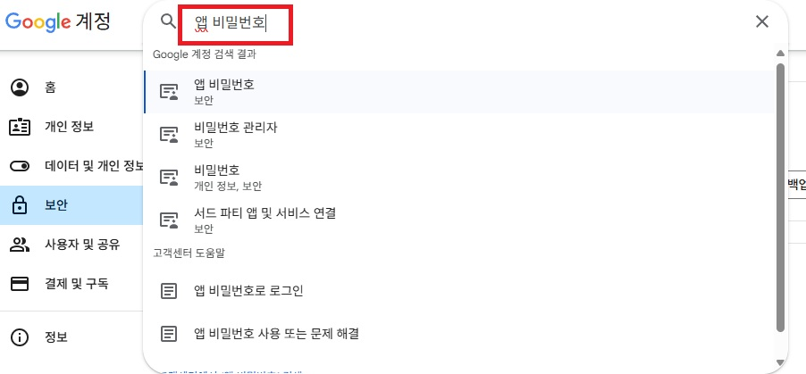

<center><strong>Figure 8. Process for generating an app password</strong></center>

Information related to app password setup: [click](https://support.google.com/accounts/answer/185833?hl=ko)


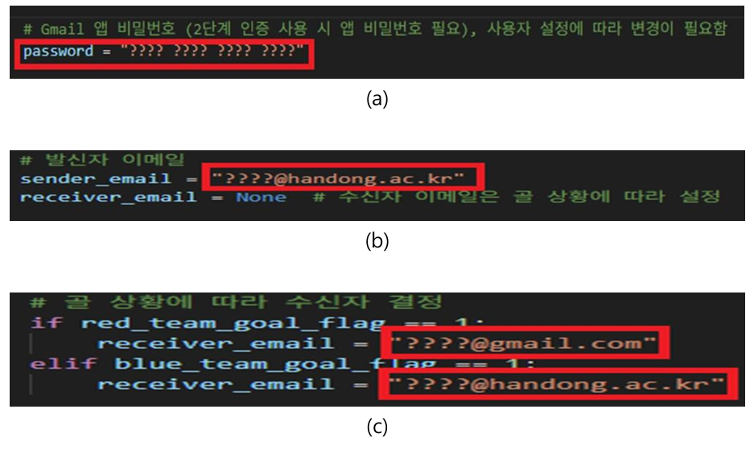

<center><strong>Figure 9. How to send an email in VS Code (a) App password of the sender's email account (b) Sender's email address (c) Recipient's email address</strong></center>

---


### 6. Arduino Code (Optional)

 The following Arduino code controls two WS2812B RGB LED rings using the FastLED library. One ring  displays real-time ball possession percentages between the red and blue teams, and the other  reacts to in-game events such as goals, throw-ins, and goal line outs.

**Full Code**: [Github Link](https://github.com/LeeJunjae1/DLIIP_FINAL_21700766_DongjunHan_22000573_JunjaeLee) (Download all files from the repository to run the program)


#### 6.1 Hardware Requirements

- **ESP32 board** (e.g., LOLIN D32, ESP32 DevKit v1, etc.)
- **2 × WS2812B RGB LED rings** (each with 24 LEDs)
- **External 5V power supply** (recommended if LED brightness is high)
- **330–470Ω resistor** between ESP32 data pin and first LED (optional but improves signal quality)
- **1000µF capacitor** between VCC and GND of LED power (optional but protects against voltage spikes)
- **Common ground** between ESP32 and LED power supply


#### 6.2 Software Requirements

- **Arduino IDE**: https://www.arduino.cc/en/software

- **ESP32 Board Package**:

  - Arduino IDE → Preferences → Add URL:

    ```
    https://raw.githubusercontent.com/espressif/arduino-esp32/gh-pages/package_esp32_index.json
    ```

  - Then go to: Tools > Board > Boards Manager, search “ESP32” and install.

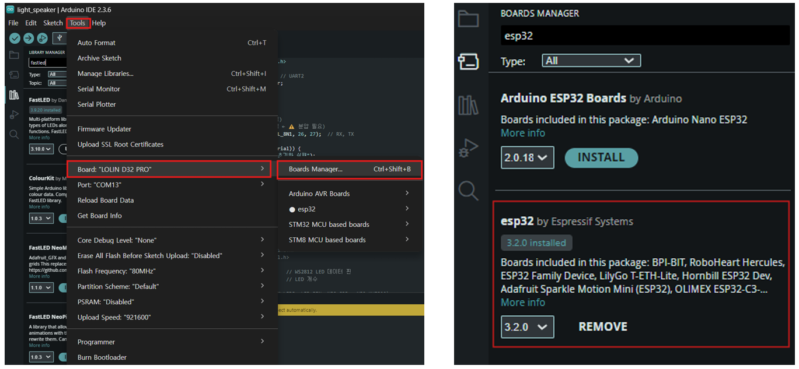

<center><strong>Figure 10. How to install ESP32 on Arduino</strong></center>


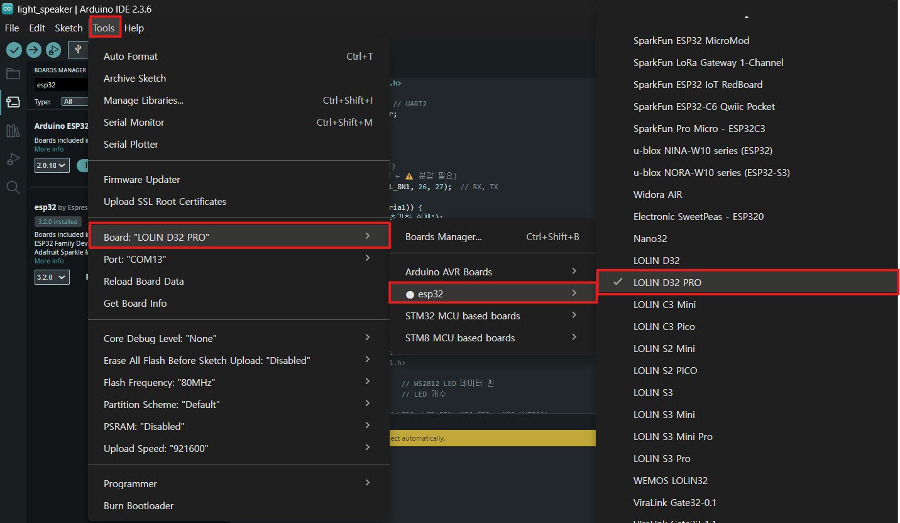

<center><strong>Figure 12. How to select the ESP32 board in Arduino</strong></center>


- **FastLED Library**:

  - Arduino IDE → Sketch > Include Library > Manage Libraries
  - Search for FastLED and install (by Daniel Garcia)

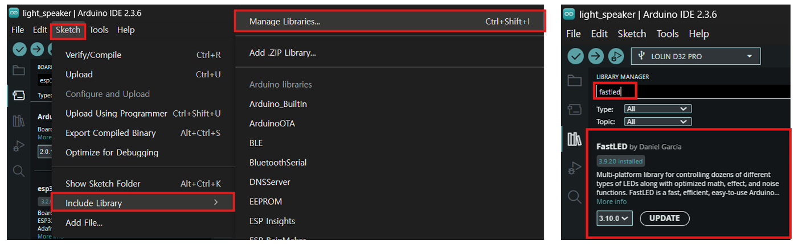

<center><strong>Figure 13. How to configure the Library</strong></center>


#### 6.3 Pin Configuration and LED Mapping

| Purpose        | Pin # | Variable     | LED Array         |
| -------------- | ----- | ------------ | ----------------- |
| Possession LED | 27    | leds_score[] | Red/Blue ratio    |
| Event LED      | 26    | leds_event[] | Goal/Throw-in/Out |

 Make sure the number of LEDs matches your actual hardware (in this example, NUM_LEDS = 24).


#### 6.4 Serial Input Protocol

- Serial communication is handled via a Python script running in VS Code, not through the Arduino Serial Monitor.

  The ESP32 listens for newline-terminated (\n) strings over serial. These strings represent either possession data or game event commands. The input is parsed within the loop() function and used to update the LED arrays accordingly.

  #### Input Format

  - **Possession Update**:
    A string like "60,40" indicates 60% possession for the red team and 40% for the blue team.

  - **Event Commands**:

    - "GOAL" – triggers a rainbow animation

    - "THROWIN" – triggers solid neon green

    - "OUT" – triggers solid neon purple

      

#### 6.5 LED Display Logic

**6.5.1. Possession Display**

- Function: displayPossession()
- Calculates how many LEDs should be red vs blue using red_percent and NUM_LEDS
- Only leds_score[] is updated
- 

**6.5.2. Event Display**

- Function: handleEventLEDs()
- Depending on the command (GOAL, THROWIN, OUT):
  - **GOAL**: Rainbow color animation using HSV
  - **THROWIN**: Neon green (RGB: 57, 255, 20)
  - **OUT**: Neon purple (RGB: 255, 0, 255)
  - **Default**: White (no active event)


#### 6.6 Upload & Run

1. Connect the ESP32 to your PC via USB.

2. Open the Arduino IDE or VS Code with PlatformIO and upload the sketch to your ESP32

3. Make sure your Python script is connected to the correct COM port at 115200 baud

4. The Python script automatically sends possession updates and event triggers over serial to the ESP32:

   - For example:

     ```python
     ser.write("GOAL\n".encode())
     ser.write("60,40\n".encode())
     ```

5. The ESP32 receives these strings and updates the LEDs in real time:

   - leds_score[] reflects possession (red vs blue)
   - leds_event[] reflects events (goal, throw-in, out)

 No manual input is required via the Serial Monitor. All communication is handled automatically through the Python script.

## Results and Analysis

### 1. Results of Problem 1 ~ 5

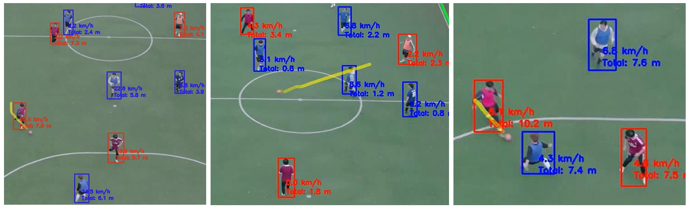

<center><strong>Figure 14. Result image for Problem 1~5</strong></center>

| No.  | Feature                                          | Criteria Summary                                             | Evaluation Result | Remarks                                                      |
| ---- | ------------------------------------------------ | ------------------------------------------------------------ | ----------------- | ------------------------------------------------------------ |
| 1    | **Detect players by team color**                 | - Players must be classified into two teams (e.g., red vs. blue) based on jersey color using HSV thresholding. - Target accuracy: ≥ **90%** correct classification per frame. | ✔ Achieved        | All players were clearly distinguished using red and blue bounding boxes with consistent results (**100%**). No team misclassifications observed. |
| 2    | **Detect the ball**                              | - Ball must be detected and tracked in frames where it is visible. - Target accuracy: ≥ **85%** presence across visible frames. - Must handle motion blur and partial occlusions. | ✔ Achieved        | The ball is consistently detected with a bounding box across frames, even under fast motion. Tracking remained stable. The ball cannot be detected when it is occluded by a player, but in all other situations, it is detected with **100%** accuracy. |
| 3    | **Visual trail effect for the ball**             | - A fading trail should visualize the last few seconds (e.g., 1.5s or 45 frames). - Must update in real-time with transparency fading. | ✔ Achieved        | A smooth yellow arc representing the ball’s recent trajectory is clearly visible, helping illustrate direction and movement. |
| 4    | **Display player speed (km/h)**                  | - Speed must be calculated based on frame-to-frame position changes. - Calibrated to real-world scale. - Value displayed above each player’s bounding box. | ✔ Achieved        | Each player has a clearly labeled speed (e.g., "20.4 km/h") rendered in real time above their bounding box. Units are accurate and visually distinguishable. |
| 5    | **Display player activity (distance in meters)** | - Cumulative distance must be tracked per player. - Acceptable error margin: within ±10% of actual distance based on calibration. | ✔ Achieved        | The label "Total: x.x m" updates per player as they move. Distance accumulates accurately and smoothly, even across varying speeds. |

* Although speed and activity level are visualized in the video, it is necessary to compare them with real values to verify their accuracy.


### 2. Result of Problem 6

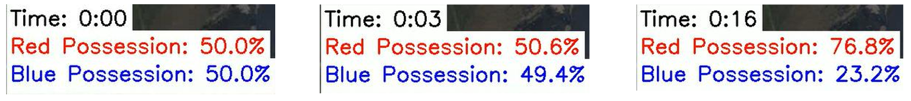

<center><strong>Figure 15. Result image for Problem 6</strong></center>

| No.  | Feature                              | Criteria Summary                                             | Evaluation Result | Remarks                                                      |
| ---- | ------------------------------------ | ------------------------------------------------------------ | ----------------- | ------------------------------------------------------------ |
| 6    | **Display team ball possession (%)** | - Possession calculated based on time of control (nearest player to the ball per frame). - Updated every second. - Displayed in percentage format (e.g., "Red: 63.7%"). - Shown visually via UI or external LED (optional). | ✔ Achieved        | The possession rate is updated in real-time and clearly displayed as "Red Possession: 76.8%" and "Blue Possession: 23.2%". The values are precise, readable, and reflect ball proximity logic accurately. |


### 3. Results of Problem 7 ~ 8

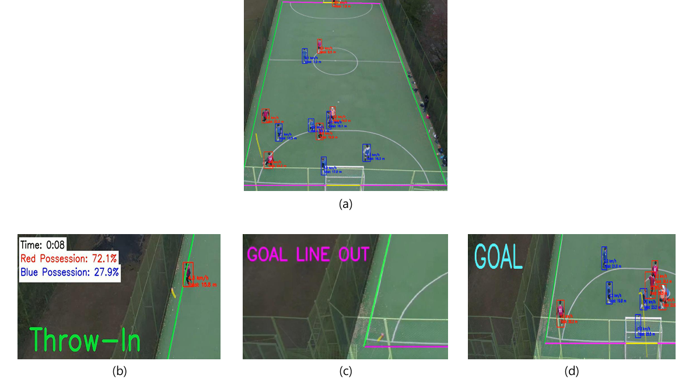

<center><strong>Figure 16. Result image for Problem 7~8 (a) Original analyzed video (b) Throw-In event result(c) Goal Line Out event result (d) Goal event result</strong></center>

| No.  | Feature                                                      | Criteria Summary                                             | Evaluation Result | Remarks                                                      |
| ---- | ------------------------------------------------------------ | ------------------------------------------------------------ | ----------------- | ------------------------------------------------------------ |
| 7    | **Draw field lines (corner, sideline, goal) with different colors** | - Use homography to align field lines to actual layout. - Different colors for each line type (e.g., red: goal, green: sideline, purple: corner). - Lines must align within ±20 pixels of actual field lines for 95% of the video duration. | ✔ Achieved        | Field lines are clearly rendered in distinct colors and correctly mapped to the field boundaries using homography. Sidelines (green), goal lines (yellow), and corners (purple) are consistent and stable throughout the footage. |
| 8    | **Detect and classify ball out-of-bound events**             | - Detect when the ball crosses field boundaries. - Classify events as `"GOAL"`, `"OUT"`, `"THROW-IN"`, `"CORNER"` based on location and context. - Display event type visually (e.g., text or LED). - Log with timestamp. | ✔ Achieved        | "Throw-In" event was correctly detected and displayed in real time with green text. The ball crossing the sideline was properly classified and reflected in the interface. Classification logic based on ball position and context is functioning as expected. |


### 4. Result of Problem 9

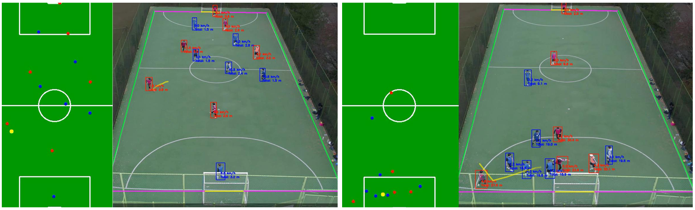

<center><strong>Figure 17. Result image for Problem 9</strong></center>

| No.  | Feature                                    | Criteria Summary                                             | Evaluation Result | Remarks                                                      |
| ---- | ------------------------------------------ | ------------------------------------------------------------ | ----------------- | ------------------------------------------------------------ |
| 9    | **Generate 2D heatmap of player movement** | - Accumulate player positions and generate a 2D spatial heatmap per team or per player. - Must reflect frequency or density of presence over time. - Should align with the actual field layout (e.g., top-down view). - Output resolution: at least 50×30 grid cells. | ✔ Achieved        | The heatmap displays colored points corresponding to accumulated player positions, with red and blue dots showing team presence across the field. The layout matches the actual field size and orientation, and position mapping is consistent with visual tracking results. |


### 5. Result of Problem 10

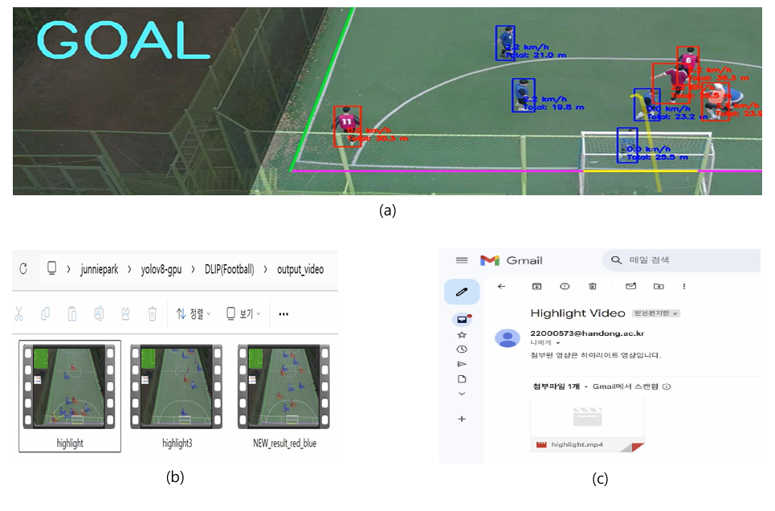

<center><strong>Figure 18. Result image for Problem 10 (a) Goal event occurred (b) Highlight video saved (c) Email sent successfully</strong></center>

| No.  | Feature                                          | Criteria Summary                                             | Evaluation Result | Remarks                                                      |
| ---- | ------------------------------------------------ | ------------------------------------------------------------ | ----------------- | ------------------------------------------------------------ |
| 10   | **Create goal highlight clip and send by email** | - Upon detecting a "GOAL" event, automatically save a 10-second video (5 seconds before and after). - Export as .mp4 (under 20MB). - Email sent with the highlight as an attachment. | ✔ Achieved        | A goal event triggers a clearly labeled highlight video, saved in the correct directory and format. The email is successfully sent with the video (highlight.mp4) attached and includes a clear subject line and message body. The process is fully automated. |

